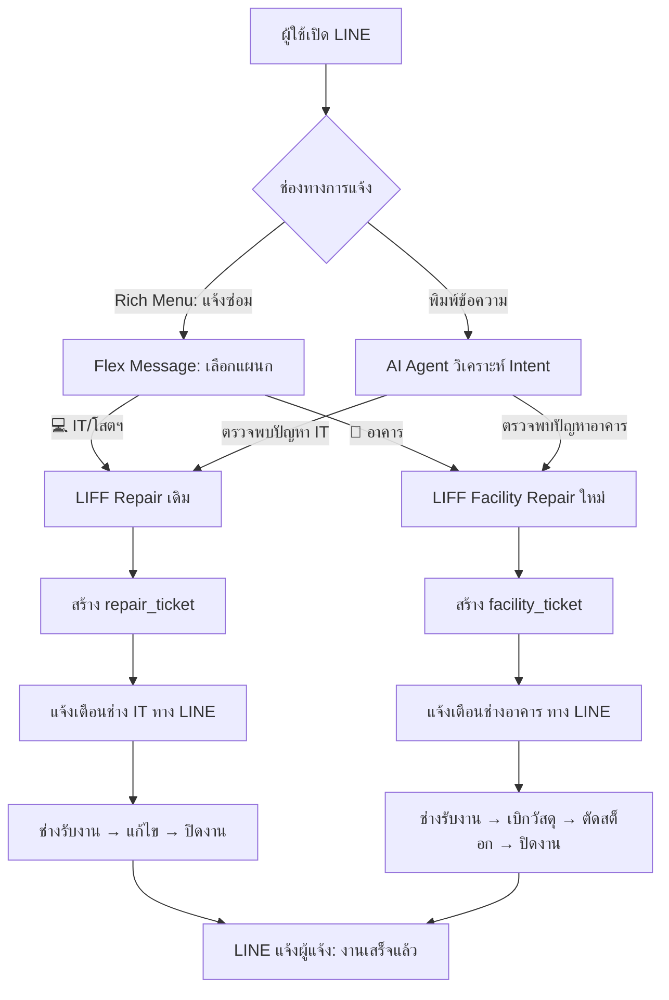

# แผนการพัฒนา CRMS6 IT — Dashboard ใหม่ + Module อาคารสถานที่

> เอกสารฉบับนี้ใช้วิเคราะห์ระบบปัจจุบัน + ออกแบบ (1) Admin Dashboard ใหม่ และ (2) Module "อาคารสถานที่"

---

## ส่วนที่ 1: วิเคราะห์ระบบปัจจุบัน (As-Is Analysis)

### 1.1 สถาปัตยกรรมหลัก
| หัวข้อ | รายละเอียด |
|---|---|
| **Framework** | Next.js 14 (App Router), TypeScript |
| **Database** | Cloud Firestore |
| **Auth** | Firebase Auth (Google Sign-In, จำกัดโดเมน `@tesaban6.ac.th`) |
| **LINE Integration** | LINE Messaging API + 3 LIFF Apps + AI Agent (Gemini) |
| **Hosting** | Vercel |
| **Storage** | Google Drive API (สำหรับรูปภาพงานถ่าย) |
| **Notifications** | LINE Notify/Push, FCM (Web Push) |

### 1.2 User Roles ปัจจุบัน (`types/index.ts`)
| Role | ความสามารถ |
|---|---|
| `user` | แจ้งซ่อม, จองห้อง, ดู Gallery/Video |
| `technician` | จัดการงานซ่อม, คลังอุปกรณ์ (แบ่ง zone: `junior_high` / `senior_high` / `all`) |
| `moderator` | อนุมัติจอง, จัดการงานซ่อม |
| `admin` | ทุกอย่าง + Command Center + Photography + Users |
| `isPhotographer` | บันทึกงานภาพ, อัปโหลดรูป (flag แยก ไม่ใช่ role) |

### 1.3 Firestore Collections ปัจจุบัน (12 collections)
```
users                 → ข้อมูลผู้ใช้ + role + responsibility + lineUserId
repair_tickets        → ใบแจ้งซ่อมโสตฯ/IT (status: pending→in_progress→completed)
products              → คลังอุปกรณ์ IT (unique items + bulk items)
transactions          → ประวัติยืม/เบิก/คืนอุปกรณ์
bookings              → การจองห้องประชุม
photography_jobs      → งานถ่ายภาพ/กิจกรรม
daily_reports         → รายงานประจำวันของช่างภาพ
activities            → Activity Log ของระบบ
video_gallery         → คลังวิดีโอกิจกรรม
line_bindings         → เชื่อม LINE userId ↔ Firebase UID
ai_conversations      → บันทึกบทสนทนา AI Agent
it_knowledge_base     → ฐานความรู้ IT
feedbacks             → Feedback จากผู้ใช้งาน
stats                 → สถิติรวม
otp_codes             → OTP สำหรับผูกบัญชี LINE (server-only)
```

### 1.4 Web App Pages (Routes)
| Route | หน้าที่ | เข้าถึงได้ |
|---|---|---|
| `/` | Dashboard หลัก (ปฏิทิน, สถิติ, Activity Feed) | ทุก Role |
| `/repair` | หน้าแจ้งซ่อม (สำหรับผู้ใช้) | ทุก Role |
| `/booking` | หน้าจองห้องประชุม | ทุก Role |
| `/gallery` | ประมวลภาพกิจกรรม | ทุก Role |
| `/video-gallery` | คลังวิดีโอ | ทุก Role |
| `/profile` | โปรไฟล์ | ทุก Role |
| `/my-work` | งานของฉัน (สำหรับช่าง/ตากล้อง) | technician, photographer |
| `/admin/dashboard` | Command Center (สถิติรวม + Quick Links) | admin |
| `/admin/repairs` | จัดการงานซ่อม (ดู/รับงาน/ปิดงาน) | moderator, technician |
| `/admin/bookings` | จัดการการจอง (อนุมัติ/ปฏิเสธ) | moderator |
| `/admin/photography` | จัดการงานถ่ายภาพ | admin |
| `/admin/inventory` | คลังอุปกรณ์ IT | technician, photographer |
| `/admin/users` | จัดการผู้ใช้งาน (แก้ Role) | admin |
| `/admin/knowledge-base` | ฐานความรู้ IT | admin |

### 1.5 LINE Integration ปัจจุบัน
| Component | รายละเอียด |
|---|---|
| **LINE Webhook** (`api/line-webhook`) | รับข้อความ → AI Agent ประมวลผล → ตอบกลับ |
| **AI Agent** (`lib/aiAgent.ts`, 1,226 บรรทัด) | Gemini-based, รองรับ intent: แจ้งซ่อม, เช็คห้อง, ค้นหาภาพ/วิดีโอ, ดูงาน, ฯลฯ |
| **Agent Functions** (`lib/agentFunctions.ts`, 760 บรรทัด) | Firestore queries + สร้าง Ticket + แจ้งเตือนช่าง |
| **LIFF: `/liff/repair`** | ฟอร์มแจ้งซ่อม + ประวัติ (ใน LINE WebView) |
| **LIFF: `/liff/booking`** | จองห้องประชุม (ใน LINE WebView) |
| **LIFF: `/liff/entry`** | หน้าผูกบัญชี LINE ↔ ระบบ (OTP) |
| **Flex Message Templates** (`utils/flexMessageTemplates.ts`) | สร้าง Card สวยๆ สำหรับ: แจ้งซ่อมใหม่, ซ่อมเสร็จ, งานถ่ายภาพ, สถานะ |
| **Notify Repair** (`api/notify-repair`) | Multicast แจ้งช่างตาม `responsibility` (zone) |

### 1.6 Navigation ปัจจุบัน
- **Desktop:** `TopHeader` (logo + search + theme + user menu) + `SideQuickAccess` (icon bar ซ้ายมือ, กรองตาม role)
- **Mobile:** `BottomNavigation` (5 tabs: หน้าหลัก, แจ้งซ่อม, FAB(+), จองห้อง, เพิ่มเติม/โปรไฟล์)
- **เมนู "เพิ่มเติม"** (mobile): กรองตาม role เช่น admin เห็น Command Center, technician เห็น งานซ่อม/คลังอุปกรณ์

### 1.7 สิ่งที่มีอยู่แล้วที่ใช้ต่อได้ทันที
- ✅ ระบบ `responsibility` ใน `UserProfile` (ปัจจุบัน: `junior_high` / `senior_high` / `all`)
- ✅ `notify-repair` API ที่กรองช่างตาม `responsibility` อยู่แล้ว
- ✅ Flex Message Templates ที่ extensible (มี type system)
- ✅ AI Agent ที่มี intent routing อยู่แล้ว (เพิ่ม intent ใหม่ได้)
- ✅ LIFF infrastructure ที่พร้อม (auth, binding, haptic feedback)
- ✅ Location/Room mapping ใน `agentFunctions.ts`

---

## ส่วนที่ 2: สิ่งที่ต้องเพิ่ม (To-Be Design)

### 2.1 ขยาย User Roles

**ปัจจุบัน:** `UserRole = 'user' | 'technician' | 'admin' | 'moderator'`
**ใหม่:** เพิ่ม role `facility_technician` แยกจาก `technician` (ช่างโสต/IT) อย่างชัดเจน

```typescript
// types/index.ts — ขยายจากเดิม
export type UserRole = 'user' | 'technician' | 'facility_technician' | 'admin' | 'moderator';
```

| Role | หน้าที่ | เห็นอะไร |
|---|---|---|
| `technician` | ช่างโสต/IT (เดิม) | งานซ่อม IT, คลังอุปกรณ์ IT, หน้างานของฉัน |
| `facility_technician` | **ช่างอาคารสถานที่ (ใหม่)** | งานซ่อมอาคาร, คลังวัสดุช่าง, หน้างานของฉัน |
| `admin` | ผู้ดูแลระบบ | เห็นทุกอย่างทุกแผนก |

### 2.2 Firestore Collections ใหม่

#### `facility_items` — คลังวัสดุสิ้นเปลือง (แยกจาก `products`)
```typescript
interface FacilityItem {
  id?: string;
  name: string;             // "หลอดไฟ LED 18W", "ก๊อกน้ำสแตนเลส"
  category: string;         // "ไฟฟ้า", "ประปา", "เบ็ดเตล็ด"
  quantity: number;         // จำนวนคงเหลือ
  unit: string;             // "หลอด", "อัน", "ชิ้น"
  reorderLevel: number;     // จุดสั่งซื้อ (ถ้าน้อยกว่านี้ → แจ้งเตือน)
  imageUrl?: string;
  location?: string;        // ตำแหน่งจัดเก็บในห้องช่าง
  createdAt: Timestamp;
  updatedAt: Timestamp;
}
```

#### `facility_tickets` — ใบแจ้งซ่อมอาคาร (แยกจาก `repair_tickets`)
```typescript
interface FacilityTicket {
  id?: string;
  requesterName: string;
  requesterEmail: string;
  room: string;             // ใช้ Location Master Data เดิม
  zone?: string;            // โซน/ตึก
  issueCategory: string;    // "แอร์", "ไฟฟ้า", "ประปา", "โครงสร้าง"
  description: string;
  images: string[];
  status: 'pending' | 'in_progress' | 'waiting_parts' | 'completed' | 'cancelled';
  priority?: 'low' | 'normal' | 'urgent';
  technicianId?: string;
  technicianName?: string;
  solutionNote?: string;
  partsUsed?: {
    itemId: string;
    name: string;
    quantity: number;
  }[];
  createdAt: Timestamp;
  updatedAt: Timestamp;
}
```

### 2.3 Workflow: LINE → สร้าง Ticket → ช่างรับงาน → ปิดงาน



### 2.4 LINE Rich Menu ใหม่ (Service Portal)

| ปุ่ม | Action |
|---|---|
| 🛠 **แจ้งซ่อม** | Flex Message ให้เลือก: 💻 IT/โสตฯ หรือ 🏢 อาคาร → เปิด LIFF |
| 📅 **จองห้องประชุม** | เปิด LIFF Booking (เดิม) |
| 📷 **ภาพ/วีดีโอ** | เปิดเว็บ Gallery |
| 📋 **ติดตามสถานะ** | LIFF แสดงทุก Ticket (ซ่อมIT + ซ่อมอาคาร + จอง) รวมหน้าเดียว |
| 💬 **แชทกับ AI** | ส่งข้อความตรง → AI Agent |
| ℹ️ **เกี่ยวกับ** | ข้อมูลติดต่อ/ช่วยเหลือ |

### 2.5 AI Agent Intent Routing (ขยายจากเดิม)

เพิ่ม intent ใหม่ใน AI System Prompt:
- `create_facility_repair` → สร้าง FacilityTicket
- `check_facility_repair` → เช็คสถานะงานซ่อมอาคาร
- `facility_technician_work` → ดูงานอาคารของช่าง

AI จะวิเคราะห์คำว่า "แอร์", "ไฟ", "ประปา", "ก๊อกน้ำ", "หลอดไฟ" → route ไปงานอาคาร  
คำว่า "คอม", "จอ", "เน็ต", "โปรเจคเตอร์", "ไมค์" → route ไปงาน IT

### 2.6 Admin Dashboard ใหม่ (Role-Aware + Export/Print)

#### ปัญหาของ Dashboard ปัจจุบัน
- เปิดได้เฉพาะ **admin/moderator** → ช่าง (technician) ไม่มี command center
- สถิติ hardcode เฉพาะ 5 ตัว (repair/booking/product/user) → ไม่ครอบคลุม
- ไม่มี **Export/Print** สถิติ
- ไม่สามารถ **แยกดูรายคน** (per-technician/per-photographer)

#### Dashboard Layout ใหม่ (Bento Grid)
```
┌──────────────────────────────────────────────┐
│  Header: สวัสดี + วันที่ + Role Badge        │
├──────────────────┬───────────────────────────┤
│  Summary Cards   │  Period Selector          │
│  (role-aware)    │  + Quick Actions          │
├──────────────────┼───────────────────────────┤
│  Repair Stats    │  Booking / Photography    │
│  IT + อาคาร      │  Stats                    │
├──────────────────┴───────────────────────────┤
│  Per-Person Table (filterable by technician) │
│  [Export Excel] [Print PDF]                  │
├──────────────────────────────────────────────┤
│  Low Stock Alerts  │  Recent Activity Feed   │
└──────────────────────────────────────────────┘
```

#### Role-Based Access (ใครเห็นอะไร)
| Role | เห็น Section ไหน |
|---|---|
| `admin` | ทุก Section (IT + อาคาร + จอง + ถ่ายภาพ + ผู้ใช้) |
| `moderator` | งานซ่อม IT + การจอง |
| `technician` | งานซ่อม IT + คลัง IT |
| `facility_technician` | งานซ่อมอาคาร + คลังวัสดุช่าง |
| `isPhotographer` | งานถ่ายภาพ |

#### Export/Print
- **Export Excel:** สร้าง `.xlsx` มีหลาย sheets (Summary, Per-Person, Detailed Tickets)
- **Print PDF:** รายงาน PDF พร้อมโลโก้โรงเรียน + ช่วงเวลาที่เลือก
- ทั้ง 2 อย่างจะ export **เฉพาะข้อมูลที่ role เห็น** + ตาม period ที่เลือก

#### Per-Person Filter
- Dropdown เลือก technician/photographer → สถิติเปลี่ยนเฉพาะคนนั้น
- ตารางแสดง breakdown ต่อคน (งานรอ, กำลังทำ, เสร็จ)

#### Period Selector
- วันนี้ / 7 วัน / 30 วัน / เดือนนี้ / ทั้งหมด → กรอง query ตาม date range

#### Firebase Optimization Strategy
| แนวทาง | ก่อน | หลัง |
|---|---|---|
| **Dashboard Stats** | 5× `getCountFromServer` (5 reads) | 1-3× `getDoc` จาก pre-computed stats docs |
| **Per-Period Queries** | ไม่มี (query ทั้งหมด) | ใช้ date-range filter + composite index |
| **Per-Person Stats** | ต้อง query ทุก ticket แล้ว group ฝั่ง client | Pre-computed per-technician counts ใน stats doc |
| **Aggregation Write** | เฉพาะ inventory | ขยายให้ repair/booking/photography increment/decrement ตอนสร้าง/อัปเดต |

**Pre-computed Stats Documents ใหม่:**
- `stats/repairs` → count per status + per technician
- `stats/bookings` → count per status
- `stats/photography` → count per status, per photographer
- `stats/facility_repairs` → count per status + per technician (อนาคต)
- `stats/facility_items` → total + low stock count (อนาคต)

---

### 2.7 Navigation ปรับปรุง

#### Sidebar & Bottom Nav (กรองตาม role)
| ช่าง IT (`technician`) | ช่างอาคาร (`facility_technician`) |
|---|---|
| งานซ่อม IT (`/admin/repairs`) | งานซ่อมอาคาร (`/admin/facility-repairs`) |
| คลังอุปกรณ์ IT (`/admin/inventory`) | คลังวัสดุช่าง (`/admin/facility-inventory`) |
| งานของฉัน (`/my-work`) | งานของฉัน - อาคาร (`/my-work/facility`) |

- Command Center เปิดให้ **admin, moderator, technician, facility_technician** เห็น

#### เพิ่ม Admin Pages ใหม่
| Route | หน้าที่ | เข้าถึงได้ |
|---|---|---|
| `/admin/facility-repairs` | จัดการงานซ่อมอาคาร (Kanban Board) | `facility_technician`, admin |
| `/admin/facility-inventory` | คลังวัสดุสิ้นเปลือง (CRUD + แจ้งเตือน stock ต่ำ) | `facility_technician`, admin |
| `/my-work/facility` | **หน้างานของฉัน (อาคาร)** — ดูงานที่ได้รับมอบหมาย, รับงาน, ปิดงาน | `facility_technician` |

#### LIFF ใหม่
| Route | หน้าที่ |
|---|---|
| `/liff/facility-repair` | ฟอร์มแจ้งซ่อมอาคาร (เลือก issueCategory, ห้อง, แนบรูป) |

### 2.9 หน้าแจ้งซ่อมแบบ Tab (Web + LIFF)

ใช้หน้า **`/repair` เดิม** เพิ่ม Tab ให้ผู้ใช้เลือกประเภทงาน:

```
┌─────────────────────────────────────────┐
│  🛠️ แจ้งซ่อม                           │
│                                         │
│  ┌────────────────┬───────────────────┐  │
│  │ 💻 IT / โสตฯ   │  🏢 อาคารสถานที่  │  │
│  │   (active)     │                   │  │
│  └────────────────┴───────────────────┘  │
│                                         │
│  Tab IT (เดิม):                         │
│  - ข้อมูลผู้แจ้ง / เบอร์โทร             │
│  - โซน (ม.ต้น / ม.ปลาย)                │
│  - ห้อง / สถานที่                       │
│  - รายละเอียดอาการ                      │
│  - รูปภาพ                              │
│                                         │
│  Tab อาคาร (ใหม่):                      │
│  - ข้อมูลผู้แจ้ง / เบอร์โทร             │
│  - ⭐ หมวดปัญหา (แอร์/ไฟฟ้า/ประปา/...)  │
│  - โซน (ม.ต้น / ม.ปลาย)                │
│  - ห้อง / สถานที่                       │
│  - รายละเอียดอาการ                      │
│  - รูปภาพ                              │
│                                         │
│  [ส่งแจ้งซ่อม]                          │
└─────────────────────────────────────────┘
```

**ความชัดเจนสำหรับ User:**
- Tab มีไอคอน + สี + คำอธิบายชัดเจน (💻 IT/โสตฯ = สีส้ม, 🏢 อาคาร = สีเขียว)
- เมื่อเลือก Tab อาคาร → Header เปลี่ยนเป็น **"แจ้งซ่อมอาคารสถานที่"** + สีเขียว
- ปุ่มส่ง เปลี่ยนสีตาม Tab (ส้ม = IT, เขียว = อาคาร)
- Submit → บันทึกลง **collection ที่ถูกต้อง** อัตโนมัติ (IT → `repair_tickets`, อาคาร → `facility_tickets`)
- แจ้งเตือนช่าง → ส่งไปหา **role ที่ถูกต้อง** (IT → `technician`, อาคาร → `facility_technician`)

**LIFF ก็ใช้แนวทางเดียวกัน** → Tab على หน้า `/liff/repair` เดิม ไม่ต้องสร้าง LIFF ใหม่

---

### 2.10 Firestore Security Rules (เพิ่ม)
```
// facility_items — ช่างอาคาร + admin อ่าน/เขียนได้
match /facility_items/{itemId} {
  allow read: if isAuthenticated();
  allow create, delete: if isAdmin();
  allow update: if isAdmin() || isFacilityTechnician();
}

// facility_tickets — ทุกคนดูได้, ทุกคนสร้างได้, ช่างอาคาร/admin อัปเดตได้
match /facility_tickets/{ticketId} {
  allow read: if isAuthenticated();
  allow create: if isAuthenticated();
  allow update: if isAdmin() || isFacilityTechnician();
  allow delete: if isAdmin();
}
```

---

## ส่วนที่ 3: สรุปไฟล์ที่ต้องแก้ไข/เพิ่มใหม่

### ไฟล์ใหม่ (NEW)
| ไฟล์ | หน้าที่ |
|---|---|
| `hooks/useDashboardStats.ts` | Hook ดึง pre-computed stats ตาม role (1-3 reads) |
| `utils/dashboardExport.ts` | Export Excel (หลาย sheets) + Print PDF สำหรับ Dashboard |
| `app/components/dashboard/PersonFilter.tsx` | Component เลือก/กรองช่างรายคน |
| `app/admin/facility-repairs/page.tsx` | หน้าจัดการงานซ่อมอาคาร |
| `app/admin/facility-inventory/page.tsx` | หน้าจัดการคลังวัสดุช่าง |
| `app/my-work/facility/page.tsx` | **หน้างานของฉัน (อาคาร)** ดูงาน/รับงาน/ปิดงาน |
| `components/repair/FacilityRepairForm.tsx` | ฟอร์มแจ้งซ่อมอาคาร (component แยก ใช้ร่วมกับ Web + LIFF) |
| `hooks/useFacilityTickets.ts` | Hook ดึง/อัปเดต facility_tickets |
| `hooks/useFacilityInventory.ts` | Hook จัดการ facility_items |
| `app/api/notify-facility/route.ts` | API แจ้งช่างอาคารทาง LINE |

### ไฟล์ที่ต้องแก้ไข (MODIFY)
| ไฟล์ | สิ่งที่แก้ |
|---|---|
| `types/index.ts` | เพิ่ม role `facility_technician`, `FacilityItem`, `FacilityTicket` types |
| `context/AuthContext.tsx` | รองรับ role `facility_technician` |
| `firestore.rules` | เพิ่ม rules สำหรับ `facility_items`, `facility_tickets` |
| `utils/aggregation.ts` | ขยาย pre-computed stats ให้ครอบคลุม repair/booking/photography |
| `app/admin/dashboard/page.tsx` | **เขียนทับทั้งหมด** เป็น Dashboard ใหม่ (role-aware + export + per-person) |
| `components/repair/RepairForm.tsx` | **เพิ่ม Tab** เลือก IT/อาคาร + เปลี่ยน header/สี/collection ตาม tab |
| `app/repair/page.tsx` | อัปเดต metadata ให้รองรับทั้ง 2 ระบบ |
| `app/liff/repair/page.tsx` | เพิ่ม Tab เหมือนหน้าเว็บ (ไม่ต้องสร้าง LIFF ใหม่) |
| `app/components/navigation/SideQuickAccess.tsx` | เปิด Command Center ให้ technician/facility_technician + เพิ่มเมนูอาคาร |
| `app/components/navigation/BottomNavigation.tsx` | เปิด Command Center ให้ technician/facility_technician + เพิ่มเมนูอาคาร |
| `lib/aiAgent.ts` | เพิ่ม intent routing สำหรับงานอาคาร |
| `lib/agentFunctions.ts` | เพิ่มฟังก์ชัน `createFacilityRepair`, `getFacilityRepairs` |
| `utils/flexMessageTemplates.ts` | เพิ่ม template สำหรับแจ้งซ่อมอาคาร |
| `app/api/line-webhook/route.ts` | ขยาย `handleTrackStatus` ให้ query ทั้ง 2 collections |

---

## ส่วนที่ 4: ลำดับการพัฒนา (Phase)

### Phase 1: Foundation (Database + Types + Rules)
1. เพิ่ม Types ใน `types/index.ts` (เพิ่ม `facility_technician` ใน `UserRole`, `FacilityItem`, `FacilityTicket`)
2. อัปเดต `firestore.rules` (เพิ่ม `isFacilityTechnician()` function)
3. อัปเดต `AuthContext.tsx` ให้รองรับ role `facility_technician`
4. เพิ่มตัวเลือก `facility_technician` ในหน้า `/admin/users`

### Phase 2: Admin Dashboard ใหม่ (ทำก่อน เพราะใช้ได้ทันทีกับระบบเดิม)
5. ขยาย `utils/aggregation.ts` → pre-computed stats docs (repair, booking, photography)
6. สร้าง `hooks/useDashboardStats.ts` → อ่าน stats doc ตาม role
7. **เขียนทับ** `app/admin/dashboard/page.tsx` → Dashboard รูปแบบใหม่
8. สร้าง `app/components/dashboard/PersonFilter.tsx`
9. สร้าง `utils/dashboardExport.ts` → Export Excel + Print PDF
10. อัปเดต Navigation → เปิด Command Center ให้ technician + facility_technician เห็น

### Phase 3: คลังวัสดุช่าง (Facilities Inventory)
11. สร้าง `hooks/useFacilityInventory.ts`
12. สร้าง `app/admin/facility-inventory/page.tsx`

### Phase 4: ใบแจ้งซ่อมอาคาร + หน้างานของฉัน
13. สร้าง `components/repair/FacilityRepairForm.tsx` + เพิ่ม Tab ใน `RepairForm.tsx`
14. สร้าง `hooks/useFacilityTickets.ts`
15. สร้าง `app/admin/facility-repairs/page.tsx`
16. สร้าง `app/api/notify-facility/route.ts`
16. **สร้าง `app/my-work/facility/page.tsx`** → หน้างานของฉันสำหรับช่างอาคาร

### Phase 5: LINE Integration
17. อัปเดต LIFF `/liff/repair` เดิม → เพิ่ม Tab อาคาร (ไม่ต้องสร้าง LIFF ใหม่)
18. อัปเดต AI Agent (intent routing)
19. อัปเดต Flex Message Templates
20. อัปเดต `handleTrackStatus`
20. ออกแบบ Rich Menu ใหม่

---

**พร้อมเริ่มเขียนโค้ดเมื่อได้รับอนุมัติครับ** 🚀
